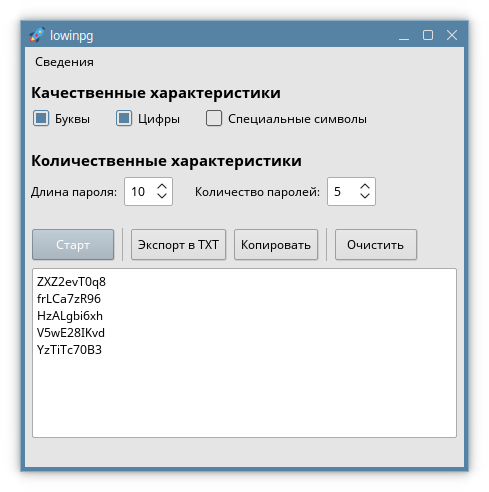

# LowinPG

Программное обеспечение для генерации паролей, написанное на C++14 (Qt v5.11.0).    

* Алгоритм ГСПЧ: **Вихрь Мерсенна**

* Язык интерфейса: **Русский**

* Целевые устройства: **Настольные компьютеры**

## Основные возможности

Параметры генерируемых паролей:

* Качественные характеристики:
  
  * Наличие букв
  
  * Наличие цифр
  
  * Наличие специальных символов

* Количественные характеристики:
  
  * Длина пароля
  
  * Количество паролей (сгенерированных за раз)

Дополнительные функции:

* Экспорт паролей в текстовый документ по выбранному пути

## Проверка сборки

Программное обеспечение было запущено и проверено на следующих системах:

| Наименование системы                 | Семейство системы | Версия приложения | Дата       |
| ------------------------------------ | ----------------- | ----------------- | ---------- |
| Astra Linux CE 2.12.46 (Orel) x86_64 | Debian Linux      | 1.1.+             | 07.11.2023 |
| Astra Linux CE 2.12.46 (Orel) x86_64 | Debian Linux      | 1.0.0             | 06.11.2023 |

## Интерфейс

